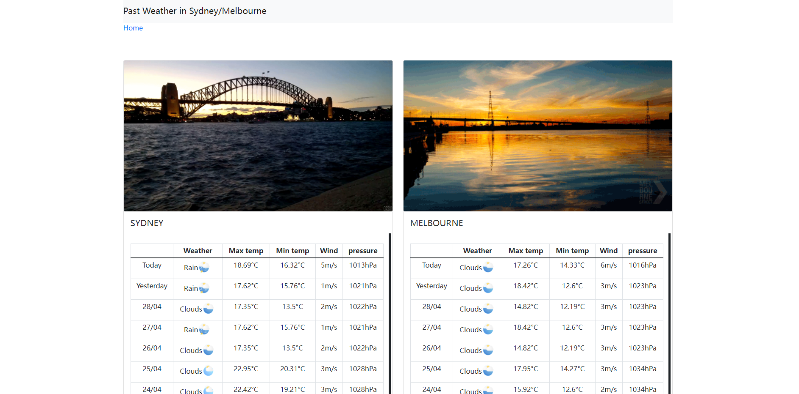

# Past Weather application

A web-based weather application for the past week using Laravel with React.js .
****

## Back-end details：
- php：8.0.2
- laravel/framework: 9.2
- guzzlehttp/guzzle: 7.4

## Front-end details：
- types/react: 18.0.5
- react: 18.0.0
- axios: 0.25,
- openapitools/openapi-generator-cli: 2.4.26
- laravel-mix: 6.0.6,
- typescript: 4.6.3
- types/node: 17.0.25
- react-bootstrap: 2.3.0
- bootstrap: 5.1.3
- moment: 2.29.3
- sass: 1.50.1

## Function

- (Batch)) Extracts same day data using free API **[openweather](https://openweathermap.org/)** to be saved to local database  -> `php artisan command:getDataFromApi `
- (API) Provides front-end with weather data collected from the local database (past 7 days in Sydney and Melbourne) using back-end API
- (Web page)Calls above API to extract weather data for page display.

## Others
- openapi: auto generate -> `npm run generate-client`
